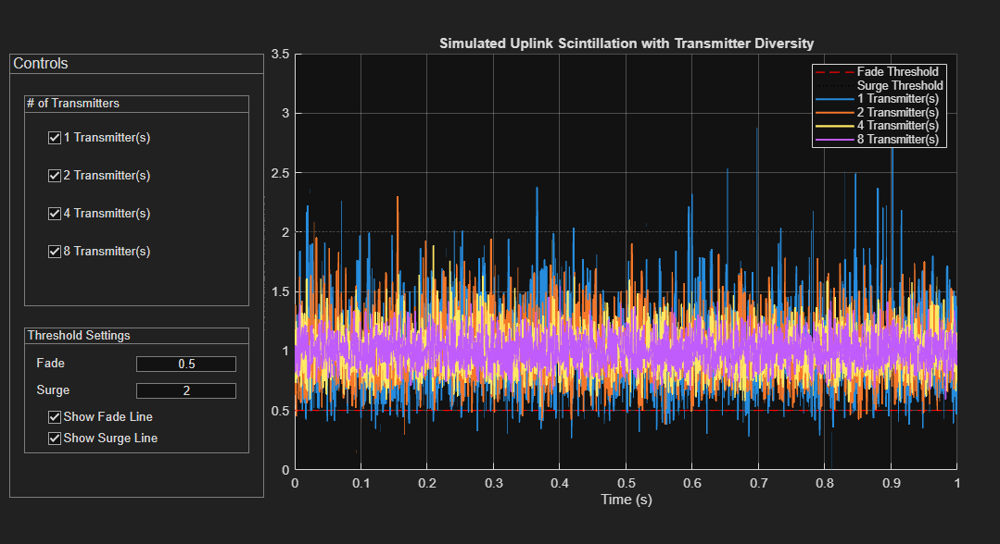

:Stem: latexmath

= Uplink Beacon Laser

As of now, the Beacon laser subsystem would follow a similar configuration to one of NASA's beacon lasers used at OCTL to support the LLCD 
project: https://ao.jpl.nasa.gov/Publications/published_troberts2016.pdf. 4 lasers outputting a wavelength of 1064nm will be used with a Master Oscillator Power Amplifier (MOPA), each with custom mounting.

The rest of this segment is based on the MATLAB script that captures scintillation by normalized irradiance for an uplink laser. All formulas are based on the book "Laser Beam Scintillation with Applications" by Andrews, Phillips, and Hopen.

== Scintillation Index and Irradiance Fluctation Model

The simulation's main objective is to calculate and model the scintillation index latexmath:[\sigma_I^2]. This is the normalized variance of the irradiance. The MATLAB script first determines a point scintillation index latexmath:[(\sigma_I^2)_p] for a single-transmitter path, which is considred the main basis for this simulation. The value latexmath:[(σ_{I,point}^2)] will be calculated using the Rytov variance and is generally considered valid across weak to strong turbulence conditions. 

[latexmath]
++++
σ_{I,point}^2 = \exp \left( \frac{0.49 σ_2^2}{(1 + 0.56 σ_2^{12/5})^{7/6}} + \frac{0.51 σ_2^2}{(1 + 0.69 σ_2^{12/5})^{5/6}} \right) - 1
++++

This script models scintillation using Gamma-Gamma Distribution, which is the product of two independent Gamma-distributed random variables that will be noted as latexmath:[x] and latexmath:[y] where

[latexmath]
++++
x \text{: Represents large-scale turbulence effects}
\newline
y \text{: Represents small-scale turbulence effects}
++++

Large-scale turbulence can be represented as slow and broad variations in the temperatures and pressures of the environment. Those issues cause beam spread, slow fading events, and fluctuations of angle precision. Small-scale turbulence can be represented as rapid fluctuations in the refractive index that lead to speckles, which directly cause beam wander and scattering.  The final normalized irradiance latexmath:[I] is calculated as the product of these two variables. 

== Model and Rytov Variance

For an uplink beacon laser, a spherical wave model was considered, as it accurately represents a laser beam transmitted from a small ground source to a Low Earth Orbit (LEO) satellite. The beam starts at the ground and immediately has to face the densest part of Earth's atmosphere, where turbulence is at its peak. As the laser traverses to the satellite located in space (obviously), the atmospheric density decreases, as well as the effects of turbulence. In this case, the laser would experience strong divergence from the point source and propagate in all directions like a sphere. This logic could also be applied for justifying a plane-wave model for downlink simulations in which the order of turbulence is reversed. Then the laser beam would physically spread like a planar wave.

The Rytov variance latexmath:[(σ_2^2)] quantifies the strength of the atmospheric turbulence. For an uplink spherical wave, the Rytov variance was found using the Hufnagel-Valley (H-V) atmospheric model for the refractive-index structure parameter, latexmath:[C_n^2(h)], along with the entire path length: 

[latexmath]
++++
C_n^2(h) = 0.00594 \left( \frac{v_{wind}}{27} \right)^2 (10^{-5}h)^{10} \exp \left( -\frac{h}{1000} \right) + 2.7 \times 10^{-16} \exp \left( -\frac{h}{1500} \right) + A_{ground} \exp \left( -\frac{h}{100} \right)
++++

The Rytov variance itself is calculated using the integral of this model while being weighted by the spherical 

[latexmath]
++++
σ_2^2 = 2.25 \cdot \mu_3 \cdot k^{7/6} (H - h_0)^{5/6} (\sec(\theta))^{11/6}
++++

where latexmath:[\mu_3] is the result of the integral:

[latexmath]
++++
\mu_3 = \int_{h_0}^{H} C_n^2(h) \left( \frac{h - h_0}{H - h_0} \right)^{5/6} \left( 1 - \frac{h-h_0}{H-h_0} \right)^{5/6} ,dh
++++

== Dealing with Transmitter Diversity

The script also mainly focuses on reducing scintillation through transmitter diversity. Basically multiple separated transmitters create uncorrelated paths independent of each other will reduce overall scintillation. This is modeled by: 

[latexmath]
++++
σ_{I,M}^2 = \frac{σ_{I,point}^2}{M}
++++

To apply averaging correctly with the Gamma-Gamma distribution, the MATLAB script adjusts latexmath:[\alpha \text{ and } \beta] parameters, which are inversely related to the large-scale latexmath:[σ_x^2] and small-scale latexmath:[σ_y^2] irradiance variances. 

[latexmath]
++++
α_{effective} = \frac{1}{σ_x^2 / M}
++++

[latexmath]
++++
β_{effective} = \frac{1}{σ_y^2 / M}
++++

The script that use the altered parameters to generate the Gamma-Gamma distrbution with less irradiance based on the number of transmitter counts.

== Simulated Scintillation

The simulated scintillation index is then given with the normalized variance or irradiance fluctuations that were found in previous calculations.

[latexmath]
++++
σ_{I}^2 = \frac{\langle I^2 \rangle - \langle I \rangle^2}{\langle I \rangle^2}
++++

